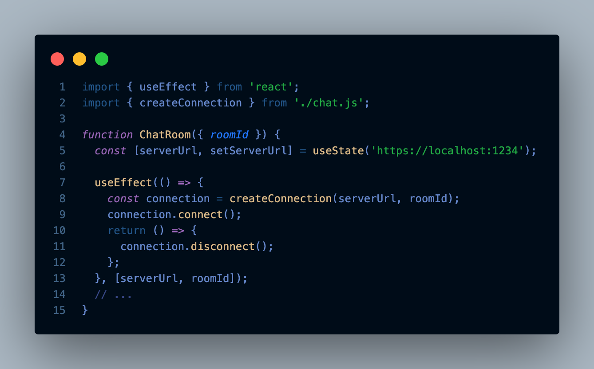

<p align="center">
  
</p>
# An interested React.js interview question about props and state: How to update a state when a prop of a component changes?

The question of how to update a state when a prop of a component changes often arises in React developer interviews. While it may seem like a simple question, it actually highlights an important concept in React development and exposes an anti-pattern that should be avoided. Let's delve into this question and explore its various aspects.

In React, props are immutable. They are passed from parent components to child components and should not be modified directly by the child. The purpose of props is to provide data and configuration to a component, allowing it to render and behave accordingly. On the other hand, state is mutable and managed internally by the component. It represents the component's internal data and can be updated using the useState hook.

Now, coming back to the question, the idea of updating the state when a prop changes goes against the React principles. React enforces a unidirectional data flow, where data is passed from parent to child components. When a prop changes, the parent component should be responsible for handling that change and updating its own state if necessary. The child component should re-render based on the new prop value, but it should not modify the state directly.

Let's consider an example to illustrate this. Suppose we have a parent component called Parent and a child component called Child. The parent component passes a prop called value to the child component.

```jsx
// Parent component
import { useState } from 'react';

const Parent = () => {
  const [value, setValue] = useState(0);

  const handleClick = () => {
    setValue(value + 1);
  }

  return (
    <div>
      <Child value={value} />
      <button onClick={handleClick}>Increment</button>
    </div>
  );
}

// Child component
const Child = ({ value }) => {
  return <div>{value}</div>;
}
```
In this example, the Parent component maintains its own state called value using the useState hook. It also defines a handleClick function that increments the state value when a button is clicked. The Child component receives the prop value and renders it directly.

Now, let's consider the scenario where we want to update the state in the Child component when the prop changes. Instead of modifying the state directly, we can utilize the useEffect hook to handle prop changes.

```jsx
// Child component
import { useEffect, useState } from 'react';

const Child = ({ value }) => {
  const [localValue, setLocalValue] = useState(value);

  useEffect(() => {
    setLocalValue(value);
  }, [value]);

  return <div>{localValue}</div>;
}
```
In this modified Child component, we use the useEffect hook to update the local state (localValue) when the prop (value) changes. The useEffect hook takes a callback function as its first parameter, which is executed whenever the dependencies in the second parameter change. In this case, we specify [value] as the dependency array, so the callback will be invoked whenever the value prop changes.

By utilizing the useEffect hook, we can update the state in the Child component when the prop changes, without breaking the unidirectional data flow or introducing any anti-patterns. The Child component remains encapsulated and decoupled from the state management logic of the parent component.

One reason why updating the state when a prop changes is considered an anti-pattern is that it breaks encapsulation. Components should be self-contained and independent. If a child component modifies its own state based on a prop change, it becomes tightly coupled to its parent and loses its reusability. This can lead to code that is difficult to maintain and reason about.

Another downside of updating the state when a prop changes is that it can lead to unexpected behavior and bugs. React is built on the concept of virtual DOM diffing, where it efficiently updates only the necessary parts of the user interface. When a component's state changes, React knows exactly which parts to update. However, if a child component modifies its own state based on prop changes, React loses track of those changes and may end up re-rendering more than necessary, impacting performance.

Furthermore, updating the state based on prop changes can introduce unnecessary complexity to the codebase. React provides mechanisms to handle prop changes effectively, such as the useEffect hook shown earlier. These built-in features allow you to detect prop changes and perform actions accordingly, without modifying the component's state directly. By leveraging these tools, you can keep your code simpler and more maintainable.

To avoid the anti-pattern of updating the state when a prop changes, it's important to follow React best practices. Instead of modifying the state directly, consider refactoring your code to lift the state up to the parent component. This way, the parent can handle the prop changes and pass down the updated values as props. Alternatively, you can use a state management library like Redux or React Context to handle shared state across components.

```jsx
// Parent component
import { useState } from 'react';

const Parent = () => {
  const [value, setValue] = useState(0);

  const handleClick = () => {
    setValue(value + 1);
  }

  return (
    <div>
      <Child value={value} setValue={setValue} />
      <button onClick={handleClick}>Increment</button>
    </div>
  );
}

// Child component
const Child = ({ value, setValue }) => {
  return <div>{value}</div>;
}
```
In this refactored example, we have lifted the state up to the Parent component. The Parent component now passes both the value and setValue functions as props to the Child component. When the button is clicked, the handleClick function in the Parent component updates the state value using setValue. The updated value is then passed down to the Child component as a prop. This approach adheres to the unidirectional data flow principle and promotes component encapsulation.

In conclusion, updating the state when a prop changes is an anti-pattern in React development. It goes against the principles of unidirectional data flow, breaks encapsulation, and can introduce bugs and complexity. By adhering to React's best practices, such as lifting state up and using appropriate hooks like useEffect, you can write more maintainable and efficient code. Remember, React provides powerful tools to handle prop changes without directly modifying the component's state.